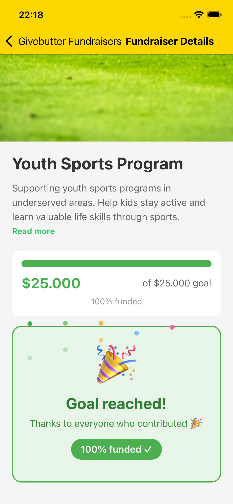

# Fundraiser Donation Flow – Implementation Summary

## Repository

**Repository URL:**  
https://github.com/abrahammontas/Tech-React-Native-Test

---

## Task 1 – Donation Flow Implementation

### Overview

Task 1 implements a full donation flow in `FundraiserDetailScreen.tsx`. Users can select a preset amount or enter a custom value, provide their name and an optional message, and submit a donation. The form integrates with the backend API, validates input, and handles success and error states. When the fundraiser goal is reached, the donation form is hidden and replaced with a celebratory “Goal reached” card.

**Key features:**
- Donation form with preset amounts ($10, $25, $50, $100, $250) and Custom option
- API integration via `api.createDonation()`
- Success: query invalidation, form reset, success message
- Error handling for validation, network, and backend errors
- Validation of amount limits (positive, ≤ remaining campaign amount, ≤ $100,000)
- UI states for loading, success, error, and goal reached

### Technical Approach

**Component structure:**  
The form is built from reusable pieces: `AmountSelector`, `AmountButton`, `DonateInput`, and `DonateButton`. Logic stays in the screen component.

**State management:**  
React `useState` for form fields (`selectedAmount`, `customAmount`, `donorName`, `message`), validation errors (`amountError`, `donorNameError`, `submitError`), and UI state (`donateSuccess`, `descriptionExpanded`).

**API integration:**  
React Query `useMutation` calls `api.createDonation(fundraiserId, payload)`. On success, it invalidates `['fundraiser', fundraiserId]` and `['donations', fundraiserId]` to refresh data.

**Error handling:**  
`parseDonationError()` uses `axios.isAxiosError()` to distinguish network errors, 400 validation errors (with backend messages), and generic failures. Errors are shown inline above the Donate button.

**Validation logic:**  
- Amount: positive, ≤ remaining goal, ≤ $100,000  
- Name: required, 2–100 characters  
- Real-time validation for amount and name with inline messages  

---

## UX and UI Improvements

Focuses on usability, conversion, and modern UX patterns.

### Floating Donate CTA

- A floating “Donate” button appears only when the donation form is not visible on screen.
- Visibility is driven by scroll position and the form’s layout (`onScroll`, `onLayout`, `useWindowDimensions`).
- The CTA hides when the form is in view.
- Tapping the CTA scrolls to the donation section.
- The CTA is not shown when the goal is reached or after a successful donation.

**Benefits:**
- Reduces scrolling to reach the form
- Keeps a clear path to donate
- Avoids duplicate CTAs when the form is visible

### Collapsible Description (Read More / Read Less)

- The fundraiser description is limited to 3 lines by default.
- “Read more” expands to show the full text.
- “Read less” collapses back to 3 lines.
- Uses `numberOfLines` and `ellipsizeMode` for truncation.

**Benefits:**
- Keeps the layout compact
- Reduces initial scrolling
- Lets users expand only when needed

### Modern Donation Form Enhancements

- **Preset amount selector:** Buttons for $10, $25, $50, $100, $250 and Custom, with selected state and scale animation.
- **Custom amount:** Numeric input when Custom is selected.
- **Dynamic Donate button:** Text updates to “Donate $25 ❤️” (or the selected amount).
- **Layout:** Card-style form, spacing, rounded corners, subtle shadow.
- **Validation:** Inline errors, amount ≤ remaining goal, real-time feedback.

---

## Additional Improvements

- **Animations:** LayoutAnimation for form expansion, Animated for amount buttons and Donate button press.
- **Goal reached UI:** Dedicated card with “Goal reached!” and confetti-style animation.
- **Success state:** Dedicated success view with “Donation successful 🎉” and placeholder for confetti.
- **Floating labels:** Labels above inputs instead of placeholders.
- **Auto-scroll:** Scroll to the form when an amount is selected.
- **Backend error visibility:** 400 responses surfaced with backend messages instead of generic errors.

---

## Screenshots / Demo

### Donation Form

### Read More / Read Less

### Goal Reached

### Donation Successful

---

## Summary

The implementation emphasizes:

- **Modern UX:** Preset amounts, floating CTA, collapsible description, and clear feedback.
- **Clean architecture:** Reusable components, clear state handling, and separation of concerns.
- **Conversion optimization:** Reduced friction, visible CTA, and progressive disclosure.
- **Robust error handling:** Backend and network errors surfaced with clear, actionable messages.
